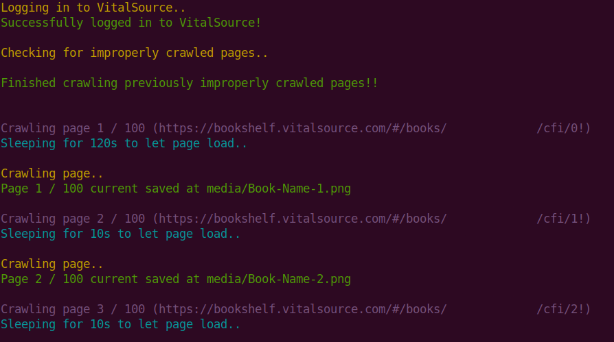
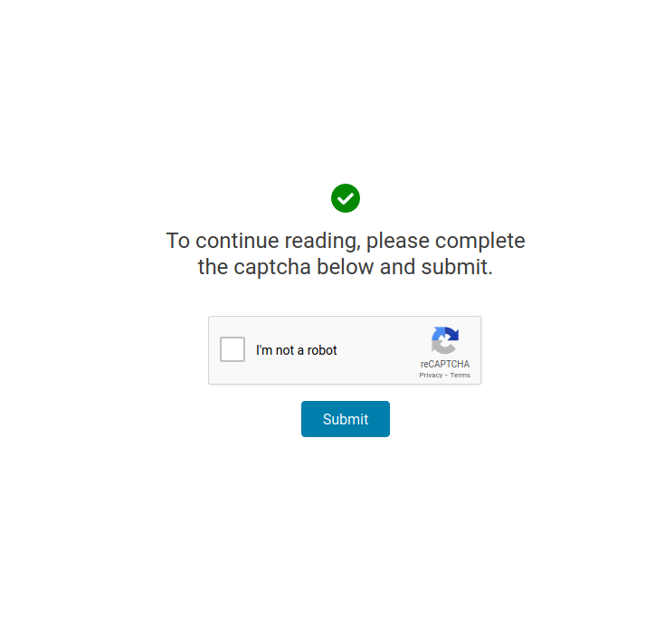

# VitalSource Crawler

Program to bypass VitalSource's 2-page per day book download limit. This program manually crawls each page of your specified book on VitalSource and saves them into PNG images.

*Disclaimer: Please ensure that copyright rules are followed! This program is made as a Proof-of-Concept to allow book owners to download their books hosted on VitalSource for their **personal** use.*

*You are responsible for any illegal distribution/violations of copyright!*

### Program features
##### 1) Email notifications
This program is built with an email alert system to notify you upon successful crawling.

##### 2) Failed crawl detection
This program is able to detect improperly crawled pages of your book and re-crawl them as necessary, provided that the configurations set are correct.

##### 3) Output re-direction
This program allows the toggling of its output into a specified file (see **verbose_mode** and **verbose_file** in *config.py*)

---
### Pre-requisites
##### 1) Mozilla Firefox

This program utilises the Selenium geckodriver for Mozilla Firefox. As such, you need to have the Mozilla Firefox browser installed on your device.

##### 2) VitalSource credentials

Since this program is built to crawl VitalSource books, you are required to have a VitalSource account and access to at least one book hosted on the platform itself.

##### 3) GUI interface

This program utilises a GUI interface for the crawling of VitalSource books. As such, CLI-based interfaces are unable to be used to run the program since a headless browser won't be used (manual inputs are required to bypass CAPTCHA challenges).

---
### Usage

##### 1) Install required modules

```bash
# Fork project
git clone https://github.com/ptrpfa/vitalsource-crawler.git

# Install requirements
pip3 install -r requirements.txt
```

##### 2) Edit necessary configurations

```python
""" Edit config.py file configurations """
 
# VitalSource login credentials
login_email = "email@gmail.com"
login_password = "password"

# VitalSource links
login_url = "https://bookshelf.vitalsource.com/#/user/signin"   # VitalSource login URL
book_url = "https://bookshelf.vitalsource.com/#/books/xxxxxx"   # VitalSource book URL
total_pages = 100                                               # Total no of pages in book
book_name = "Book-Name"                                         # Book Name

# Progam flags
verbose_mode = True     # Toggle program output
min_page_size = 20      # Minimum file size of crawled page (in KB)
sleep_time = 10         # No of seconds to sleep to allow page to load completely
long_sleep_time = 120   # No of seconds to long sleep to allow manual CAPTCHA challenge completion

# Program files
gecko_driver_file = "selenium/geckodriver"  # Driver file path
media_folder = "media/"                     # Media folder path
verbose_file = "output.txt"                 # Output file if verbose mode set to False

# Email notification
outgoing_email = 'sender@gmail.com'     # Outgoing email address
outgoing_email_password = 'password'    # Outgoing email password
outgoing_email_name = "Sender"          # Outgoing email name
incoming_email = 'recipient@gmail.com'  # Incoming email address
```

##### 3) Run program

```bash
python3 crawler.py
```

###### When running, the program's output should look something like this:



##### 4) Run program to combine exported images into a single PDF

```bash
python3 combine.py
```
---
##### Known issues

###### # 1 CAPTCHA Challenge

VitalSource will issue CAPTCHA challenges after every 100+ pages, causing the program to stop. 

To bypass this, update the the **current_index** variable to the last page crawled after every stopped crawl cycle.



The program will sleep for a longer duration of time for each first page being crawled, to allow the user to manually bypass these CAPTCHA challenges. As such, manual inputs and monitoring are required in order to download an entire VitalSource book. 

Depending on the total number of pages in the book to crawl, it may take a while for you to completely download your book. However, this is still a better alternative than using VitalSource's in-built option to download your book; which is limited to 2-pages per day and littered with watermarks.

###### # 2 Saved book

This program outputs each page of your book into a sizable PNG image. As such, the images may take up some space on your computer. Additionally, there are currently no in-built functions to export the downloaded PNG images into a PDF file. However, you can easily find PNG to PDF converters online or even build your own one!

###### # 3 Exported PDF

The combine.py program may be limited by PIL on the number of images that it can combine and export into a single PDF file.
As such, you may choose to export your images into multiple PDFs and combine them into a single PDF in the end.